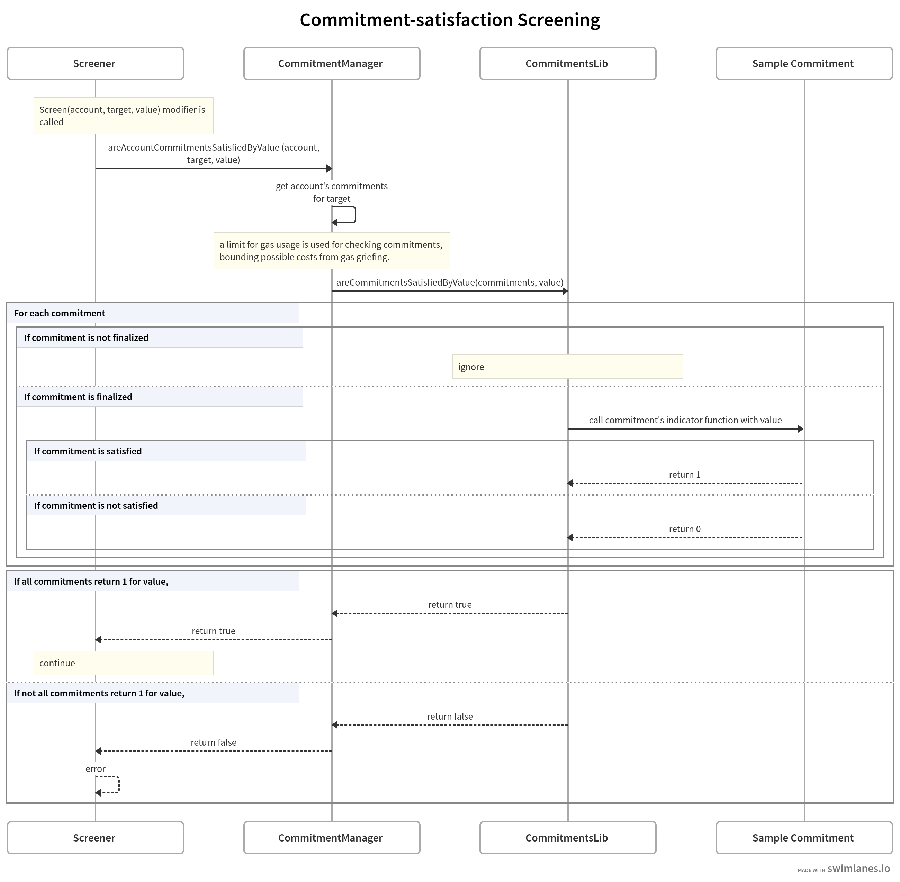

# :magic_wand: Emily: A Protocol for Credible Commitments

Emily is a specialized protocol designed to facilitate and manage credible commitments on Ethereum. This document provides an in-depth overview of Emily's architecture, functionalities, and integration methods.


## **Introduction**

In the evolving landscape of blockchain technology, ensuring credible commitments is paramount. Emily addresses this need by offering a structured and efficient way to create and manage these commitments on Ethereum. This protocol not only enhances the reliability of commitments but also integrates seamlessly with existing Ethereum standards.

For a hands-on experience, explore the [PBS commitment sample](src/samples/CommitmentPBS.sol).

## **Key Features**

### **1. Commitment Manager**
A central smart contract that:
- Enables EVM addresses to make new commitments.
- Validates if a provided value satisfies some user's commitments.

### **2. Commitment Structure**
Each commitment comprises:
- **Target**: Defines the commitment's subject, akin to 'scope' in constraint satisfaction problems.
- **Indicator Function**: A function that yields '1' if a commitment is satisfied by a specific value, and '0' otherwise.
```solidity
struct Commitment {
    uint256 timestamp;
    function (bytes memory) external view returns (uint256) indicatorFunction;
}
```
The indicator function delineates the values that fulfill the commitment.

### **3. Commitment Library (CommitmentsLib)**
A library equipped with methods to:
- Evaluate if a value satisfies to an array of commitments.
- Determine the finalization status of a commitment.
```solidity
library CommitmentsLib {
    function areCommitmentsSatisfiedByValue(Commitment[] memory commitments, bytes calldata value) public view returns (bool);
    function isFinalized(Commitment memory commitments) public view returns (bool finalized);
}
```
Commitments are currently considered finalized based on a time criterion post-inclusion. A more robust approach might involve the protocol checking a proof for the commitment's finalization.

### **4. Resource Management**
Given the gas-based operation of the EVM, resource management is crucial. Emily assigns a predetermined gas amount for evaluating any user's commitment array, ensuring a cap on computational resources and safeguarding verifiers from gas-griefing attacks.

## **Integration Guide**

### **Incorporating Emily in Smart Contracts**
To enforce commitments, smart contracts should inherit from `Screener.sol` and use the `Screen` modifier. This ensures user actions align with their commitments. When a function importing `Screen` is invoked, the `Screen` modifier activates, prompting the Commitment Manager to verify the user's commitments. The Commitment Manager then collaborates with the Commitment Library to assess the commitments. If they are met, the function proceeds; otherwise, it reverts.



### **Account Abstraction (ERC4337)**
Emily can be integrated into ERC4337 accounts to screen user operations, ensuring they meet the sender's commitments. The sample below showcases the integration process, emphasizing the `Screen` modifier's role.
```solidity
/**
* validate signature of a single userOp
* This method is called after EntryPoint.simulateValidation() returns an aggregator.
* First it validates the signature over the userOp. then it return data to be used when creating the handleOps:
* @param userOp the userOperation received from the user.
* @return sigForUserOp the value to put into the signature field of the userOp when calling handleOps.
*    (usually empty, unless account and aggregator support some kind of "multisig"
*/

function validateUserOpSignature(UserOperation calldata userOp)
    external
    view
    Screen(userOp.sender, this.validateUserOpSignature.selector, abi.encode(userOp))
    returns (bytes memory sigForUserOp)
{
    uint256[2] memory signature = abi.decode(userOp.signature, (uint256[2]));
    uint256[4] memory pubkey = getUserOpPublicKey(userOp);
    uint256[2] memory message = _userOpToMessage(userOp, _getPublicKeyHash(pubkey));

    require(BLSOpen.verifySingle(signature, pubkey, message), "BLS: wrong sig");
    return "";
}
```

### **Token Bound Accounts (ERC6551)**
Emily's commitment-enforcing logic can be applied to token-bound accounts. The modification in the `executeCall` function ensures that any executed call by the account meets its commitments.
```solidity
/// @dev executes a low-level call against an account if the caller is authorized to make calls
function executeCall(address to, uint256 value, bytes calldata data)
    external
    payable
    onlyAuthorized
    onlyUnlocked
    Screen(address(this), this.executeCall.selector, abi.encode(to, value, data))
    returns (bytes memory)
{
    emit TransactionExecuted(to, value, data);

    _incrementNonce();

    return _call(to, value, data);
}
```

## Road Ahead

- Support the creation of commitments without gas costs through EIP712 signatures.
- Allow bundling of multiple commitments for simultaneous submission.

## Contribute & Feedback
Your insights can shape the future of this initiative. Feel free to raise an issue, suggest a feature, or even fork the repository for personal tweaks. If you'd like to contribute, please fork the repository and make changes as you'd like. Pull requests are warmly welcome.

For questions and feedback, you can also reach out via [Twitter](https://twitter.com/0xfuturistic).